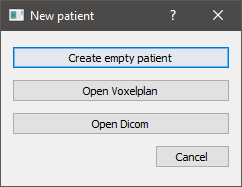
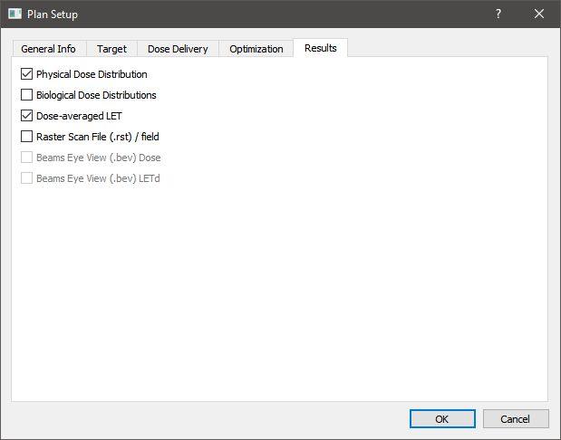

=====================================
Configuration and main usage scenario
=====================================

After opening the application you should be presented with this view:

.. image:: _images/main_window_empty.png
	:align: center

|
|

Configuration
=============

First, you need to set up the TRIP98 configuration of the application. To do that, from the main application view, click *Settings* and then *Trip98 Config*.
TRIP98 can be set up either on your local machine or a remote one, so choose the one that suits your needs.
Presented below are both of the configuration views with explanations for each field.

.. image:: _images/trip_configuration_local.png
	:width: 49 %

.. image:: _images/trip_configuration_remote.png
	:width: 49 %

|

Next up is the beam kernel setup. From the main application view, click on *Settings* and *Beam Kernels*. Below you can find its configuration view.
Note that the paths for DDD, SPC and SIS can be remote.

.. image:: _images/beam_kernel_setup.png
	:align: center
	:width: 65 %

|
|

Main usage scenario
===================

In this usage scenario you will import some patient data either from DICOM or Voxelplan, configure a simulation of a treatment plan, execute it and observe its results.

From the main application view, click on *Add patient* and then either *Open Voxelplan* or *Open DICOM*.

|

After the selected data gets loaded in, you should be presented with the following dialog box:

.. image:: _images/contour_request.png
	:align: center

|

Regardless of whether you choose to precalculate VOI contours or not, an entry with the imported data should be visible under *Patient tree*, on the left.
Here you can switch between imported files simply by clicking on their name. You should also see a preview of the imported data, more specifically one of its slices, which you can
switch by using the scroll wheel or moving the slider visible on the far right. Above the preview, you can also switch between the three different planes with a drop-down list.
Below *Patient tree*, you can find *VOI list* from which you can select any VOIs that you'd like to make visible and see its contours in the preview.

.. image:: _images/main_window_patient_loaded_contours.png
	:align: center

|

To configure the treatment plan, click on *Create plan*, go to the *Target* tab and then select one of the entries from *Target ROI*.

.. image:: _images/creating_plan_target.png
	:align: center

|

In the *Results* tab, you can choose what kind of data you'd like to get as part of the simulation results of this treatment plan.

|

Afterwards, to configure the source of the radiation dose, click on *Create field*.

.. image:: _images/creating_field.png
	:align: center

|

Note that the created treatment plans and fields are also visible under *Patient tree*.

Finally, to execute the simulation of the created treatment plan, click on *Execute*. You should see a window pop up, which reports on the progress of the simulation.

.. image:: _images/executing_plan_start.png
	:align: center

|

The simulation completes soon after the *Done* message is displayed. You can click *OK* to close the window.

.. image:: _images/executing_plan_end_wo_dvh.png
	:align: center

|

You should be able to see the distribution of the calculated dose in the preview. If the results also include a LET distribution you can switch to it by expanding the simulation entry
under *Patient tree* and clicking on the appropriate item.

.. image:: _images/main_window_dose.png
	:align: center
