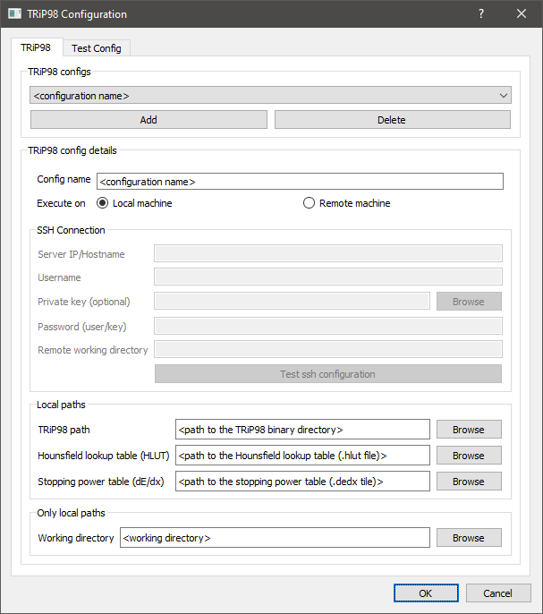
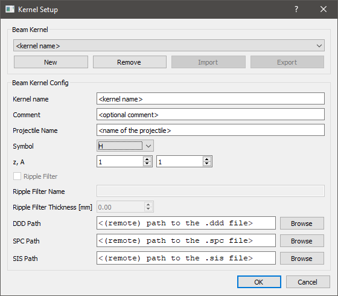
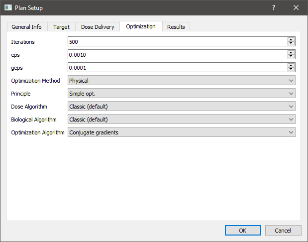
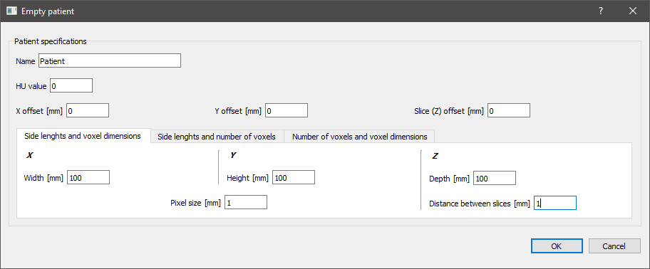
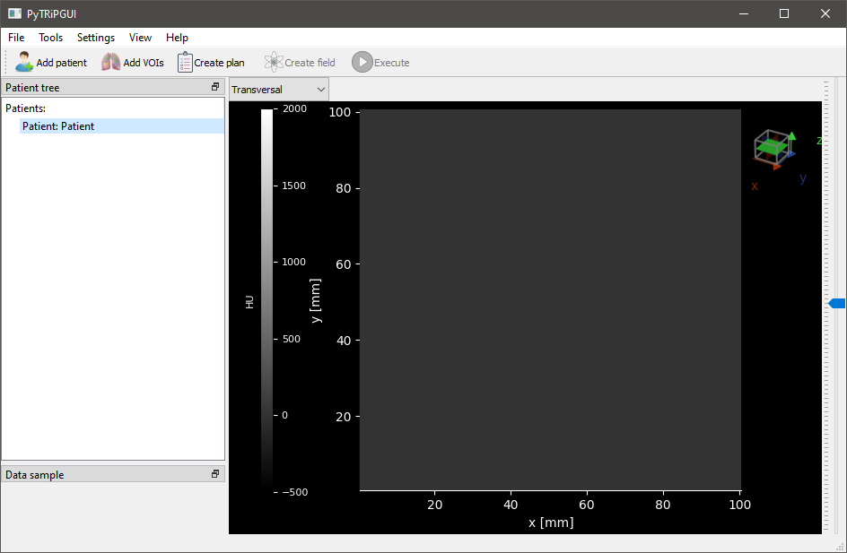
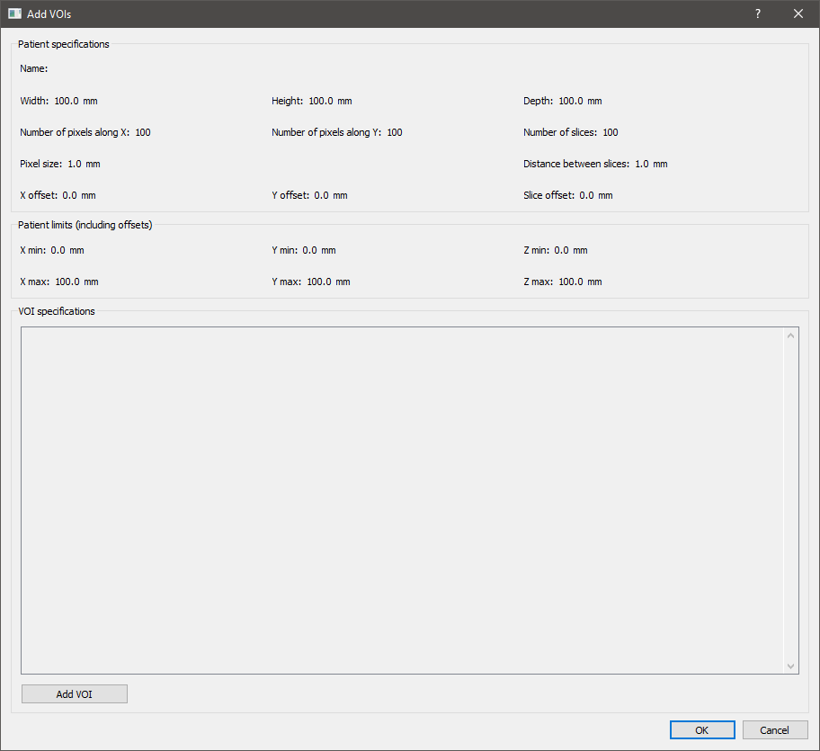
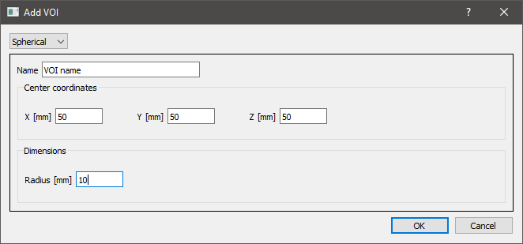
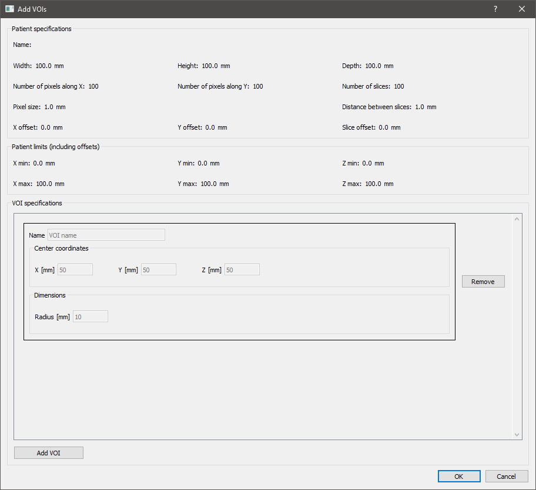
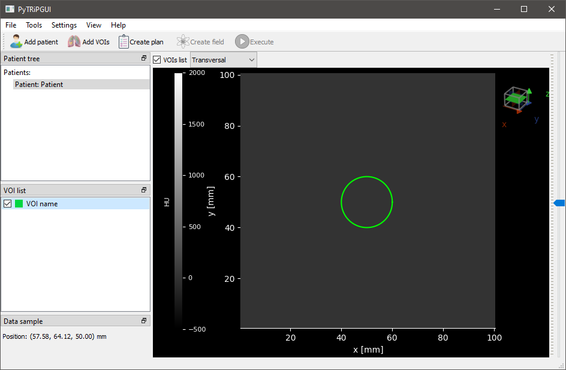

==========
User guide
==========

After opening the application you should be presented with this view:

|
|

TRiP98 installation
===================

To have the ability to calculate a simulation of a plan you have to install the TRiP98 program, that works only on Linux systems.
It can be accessed by contacting the author (according to the `installation guide <http://bio.gsi.de/DOCS/TRiP98/PRO/DOCS/trip98inst.html>`_,
send an email to the address: M.Kraemer@gsi.de).
Online documentation of this program is `available here <http://bio.gsi.de/DOCS/trip98.html>`_.

Configuration
=============

After that, you need to set up the TRIP98 configuration in PyTRiPGUI. To do that, from the main application view,
click *Settings* and then *Trip98 Config*. TRIP98 can be set up either on your local machine or a remote one, so choose
the one that suits your needs. Presented below are both of the configuration views with explanations for each field.
HLUT and dE/dx files are delivered with TRiP98.

.. image:: _images/trip_configuration_remote.png
    :width: 49 %

|

Next up is the beam kernel setup. From the main application view, click on *Settings* and *Beam Kernels*. Below you can
find its configuration view.
Note that if you are using TRiP98 remotely, the paths for DDD, SPC and SIS files must be remote as well.
DDD and SPC files are `available here <https://zenodo.org/record/4675053>`_. SIS file is delivered with TRiP98.

|
|

Main usage scenario
===================

In this usage scenario you will import some patient data either from DICOM or Voxelplan, configure a simulation of a
treatment plan, execute it and observe its results.

From the main application view, click on *Add patient* and then either *Open Voxelplan* or *Open DICOM*.

.. image:: _images/new_patient_small.png
    :align: center

|

After the selected data gets loaded in, you should be presented with the following dialog box:

|

You can choose `Yes` if you want to precalculate now VOI contours in sagittal and coronal planes. If you choose `No`
then they will be calculated in real-time while viewing those contours. Regardless of which you choose,
an entry with the imported data should be visible under *Patient tree*, on the left.
Here you can switch between imported files simply by clicking on their name. You should also see patient CT images,
more specifically one of their slices, which you can switch by using the
scroll wheel or moving the slider visible on the far right. Above the preview, you can also switch between the three
different planes with a drop-down list. Below *Patient tree*, you can find *VOI list* from which you can select any VOIs
that you'd like to make visible and see its contours in the preview.

|

To configure the treatment plan, click on *Create plan*. Then you will see this window with basic patient info.

|

Go to the *Target* tab and then select one of the entries from *Target ROI*.

|

In the *Dose Delivery* tab you can set beam kernel and other dose settings.

.. image:: _images/plan_setup_dose_delivery.png
    :align: center

|

In the *Optimization* tab you can set optimization settings.

|

In the *Results* tab you can choose what kind of data you'd like to get as part of the simulation results of this
treatment plan.

|

Afterwards, to configure the source of the radiation dose, click on *Create field*.

|

Note that the created treatment plans and fields are also visible under *Patient tree*.

Finally, to execute the simulation of the created treatment plan, click on *Execute*. You should see a window pop up,
which reports on the progress of the simulation.

|

The simulation completes soon after the *Done* message is displayed. You can click *OK* to close the window.

|

You should be able to see the distribution of the calculated dose in the preview. If the results also include a LET
distribution you can switch to it by expanding the simulation entry under *Patient tree* and clicking on the appropriate
item.

.. image:: _images/main_window_dose.png
    :align: center

|
|

Other features
==============

PyTRiPGUI also supports the following features.

|

Create an empty patient
-----------------------

For testing purposes you can create an empty patient instead of importing DICOM or Voxelplan. To do that, from the main
application view, click on *Add patient* and then *Create empty patient*.

.. image:: _images/new_patient_small.png
    :align: center

|

Here you can input some of its parameters in three different ways by switching between the tabs.

|

Add VOIs
--------

You can add VOIs to imported data or an empty patient. From the main application view, make sure an appropriate
*Patient* entry is selected under *Patient tree* and then click on *Add VOIs*.

|

Click on *Add VOI* on the bottom left.

|

Select one of the VOI shapes from the drop-down list and input its parameters.

|

Back here you can add more VOIs by clicking on *Add VOI* again, or remove the ones you added by clicking on *Remove*
next to their entry on the list. When you're done, click *Ok* on the bottom right.

|

In the main application view you can see the newly added VOIs as entries under *VOI list* and their contours in the
preview when you select them.

|
|

Export data
-----------

You can export data by right clicking a *Patient*, *Plan (.exec)* or *Dose* entry (expand *Sim* first) under *Patient tree* from
the main application view and then selecting either *Export as Voxelplan* or *Export as DICOM*, and saving it in your
file system.

.. image:: _images/main_window_export.png
    :align: center

|
|

Import dose data
----------------

You can import the dose data (part of simulation results) that you previously exported, onto patient data, by right clicking
an appropriate *Patient* entry under *Patient tree* from the main application view and then selecting either *Import
dose from Voxelplan* or *Import dose from DICOM*.

.. image:: _images/main_window_export.png
    :align: center
